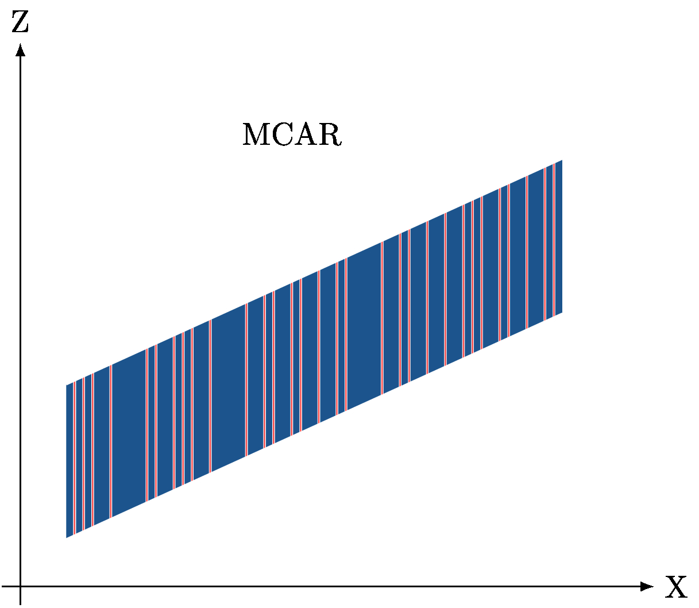
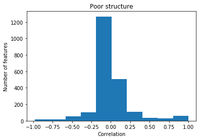
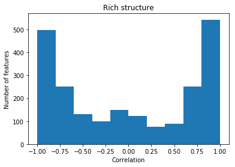

# Missing Data in Data Science

### The effect of missing values treatment on the outcome of a regression model

--- 

It is most likely you have encountered missing data. Especially in an application-oriented field like data science, available datasets are almost always incomplete. Just yesterday, a colleague of mine explored so-called 'click' features: each column represented the number of clicks on a button in a web application. Obviously, the missing values indicated a zero number of clicks on that button and an imputation model for that dataset was quickly found. But what to do in a more complicated situation? 

Whether you like it or not, missing data requires the choice of a missing values treatment. An often used and easy solution is the deletion of incomplete rows or columns; for example `pandas.dropna` in Python. However, what is the effect of this method on the outcome of the data science model? Would this outcome be different when we would replace the missing values with the column mean, median or mode? And what about more complicated missing data methods such as a multiple imputation model? 

In this blogpost, we will shortly introduce missing data mechanisms and then present the setup of a simulation study. The goal of the simulation is to explore the effect of missing data methods on the outcome of a data science regression model. To that end, we will apply a missing data method and calculate the evaluation error metrics as one would do in a data science pipeline. We compare the results for a scala of methods, mechanisms, percentages and datasets. 

---

## Missing data mechanisms

In missing data theory, we classify missing data problems into three categories: MCAR, MAR and MNAR missingness. Consider a dataset with outcome feature Y, predicting features X and some variable Z which is not used in the analysis. For any dataset with missing values in a certain feature X, the data is: 

- **Missing Completely At Random (MCAR)** when every cell has a fixed, equal probability of being missing. As a result, both large and small data values will become missing. 

- **Missing At Random (MAR)** when the probability of being missing depends on observed values. The observed values could be in another feature X or in Z. Consequently, the correlation between the incomplete and complete feature determine which values become missing. In addition, the observed values can be used to create a proper imputation model.

- **Missing Not At Random (MNAR)** when the probability of being missing depends on unobserved or missing data. This situation can occur because suitable covariates for explaining missingness have not been recorded or are otherwise unavailable or when the probability of being missing depends on the missing X values itself. 

When the missingness depends on the outcome variable Y, and when outcome variable Y is complete observed, scientific researchers would consider this a MAR situation. After all, Y can be used in the imputation model. However, in data science models, it is generally not accepted to use the outcome variable in the model. Therefore, if missingness in X depends on outcome variable Y, it makes more sense to call this a MNAR mechanism. 

Figures 1 to 3 schematically show how the multivariate relationship between any variable Z and a feature X is affected by completely random missingness, missingness depending on Z and missingness depending on X.

Figure 1               |  Figure 2                 |  Figure 3
:---------------------:|:-------------------------:|:-------------------------:
  |  ARX.jpg) |  ARZ.jpg)

---

## Simulation setup

In the simulation, we analyzed eighth datasets: four real and four simulated datasets. The import and/or generation of these datasets can be found in the [github repository](https://github.com/RianneSchouten/missing_data_science), as well as all other simulation code. 

The simulation is as follows: 

1. We start by splitting a given dataset into 60% trainingset and 40% testset. 

2. We then generate missing values in the training and testset with our function `delete_data`. We assign missing values to all X features, but the output variable remains complete. In each simulation round, we create a MCAR, MARX, MARZ, MNARX and MNARZ missingness mechanism. 

    In case of MARX, the missingness in feature X_1 depends on the values of feature X_2, X_2 depends on X_3 and so on. For MNARX, missingness in X~1 depends on X~1, X~2 on the values of X~2, and so on. For MARZ and MNARZ, we create a variable Z that correlates with the outcome variable Y. The values of Z determine which values in X become missing. For instance, records with a large value on Z have a higher probability to be missing on X~1. In case of MARZ, we use Z in the imputation model. In case of MNARZ, we do not use Z to impute. Note that Z is never part of the analysis model. 

3. We create several missingness percentages. We generate the missingness such that 5%, 10%, 15%, up to 55% of the records have at least 1 missing value. In general, 50% of the cells of all incomplete rows have a missing value.

4. We apply six missing data methods to each combination of missingness mechanism and missingness percentage.

    - **Listwise deletion:** drop incomplete rows from the dataset with Pandas `dropna`.

    - **Mean imputation:** imputation with the column (i.e. feature) mean with sklearns `Imputer` class.

    - **Median imputation:** imputation with the column (i.e. feature) median with sklearns `Imputer` class. 

    - **Random imputation:** imputation with a randomly chosen observed value (per column) with a custom adaptation of the `Imputer` class. 

    - **Regression imputation:** each column (i.e. feature) is regressed on the other features. We predict each incomplete value by using the observed values of the other features. When a predictive value is unobserved, we mean impute first. Again, we made a custom adaptation of sklearns `Imputer` class. 

    - **Stochastic regression imputation:** regression imputation as explained above, but with the addition of some noise. To each imputation, we add (or subtract) a random value. We sample the noise from a normal distribution with mean 0 and standard deviation equal to the uncertainty of the regression imputation model. Again, a custom adaptation of `Imputer`. 

5. The outcome variable Y is regressed on the X features with a `LinearRegression()` model from `sklearn.linear_model`. In particular, we apply a missing data method to the training set, fit the regression model on the training set, apply the same missing data method to the testset, and make the predictions with the fitted regression model. We evaluate our model by retrieving the following `sklearn.metrics`: `mean_squared_error`, sqrt(`mean_squared_error`), `mean_absolute_error` and `explained_variance`. We also calculate the MSE difference between the model fitted on the training set and the model applied on the testset. Hence, a negative value indicates overfitting of the model. 

6. Every combination of missingness mechanism, missingness proportion and missing values treatment is repeated 1000 times for the real datasets and 20 times for the simulated datasets (more is not needed due to the large size of these datasets). We report the average and IQR of the evaluation metrics. 

---

## Simulation outcome

All outcome values are presented in [this interactive plot](https://rianneschouten.github.io/missing_data_science/). A short discussion of the results is given below per dataset. The evaluation error metrics for the original, complete datasets are as follows: 

Dataset | MSE | RMSE  | MAE | EV   | DIF 
:------:|:---:|:-----:|:---:|:----:|:---:
Concrete slump test | 62.468 | 7.842  | 6.483 | 0.146 | -12.232
Forest Fires | 4160.603 | 50.394 | 21.477 | -0.785 | -222.325  
Red Wine Quality | 0.437 |0.661 | 0.510 | 0.298 | -0.022  
School Alcohol Consumption | 0.487 | 0.694 | 0.483 | 0.364 | -0.056 
Poor correlation, little noise |0.010 | 0.101 | 0.081 | 0.999  | -0.000
Poor correlation, much noise |24.603 | 4.960 | 3.960 |  0.992 | -0.255 
Rich correlation, little noise |0.010 | 0.099 | 0.080 |  0.999 | -0.000
Rich correlation, much noise | 24.867 | 4.97 | 3.961 |  0.999 | -0.239 

#### Concrete Slump Test

The [dataset](https://archive.ics.uci.edu/ml/machine-learning-databases/concrete/slump/) has 7 numerical features used to predict the concrete slump in cm. Compared with the values above, missing values induce an increase of MSE, RMSE and MAE and a decrease of EV. This result is obvious, because the missing data creates uncertainty in the data. 

For the same reason, the evaluation error metrics become worse when the percentage of missingness increases. It is interesting to see this effect is largest for the `dropna` method. 

When we inspect the results for a MCAR mechanism, we find that mean and median imputation perform better than regression, stochastic regression and random imputation. The results from mean and median imputation greatly overlap, indicating that the variable distributions in this dataset are quite symmetric. 

It is apparent that using regression imputation instead of mean/median imputation does not improve the model. This is the situation for all missingness mechanisms. Moreover, when the missingness depends on a variable outside the data (Z), it is not of influence whether or not you use Z to esimate the imputation (MARZ versus MNARZ). This outcome is quite unexpected. 

One possible explanation might be that in our simulation, the missingness in the training set is comparable to the missingness in the testset. You could argue that, as a consequence, any mistake you make fitting the imputation model will result in the same mistakes in the testset. As a result, it could be that the accuracy of predictions are not affected. Of course, more research on this has to be done.

Interestingly, although the mean and median imputation models return a smaller MSE, the MSE difference between training and testset is worse than with random imputation. In other words, random imputation reduces the risks of overfitting. 

#### Forest Fires

Dataset [Forest Fires](https://archive.ics.uci.edu/ml/machine-learning-databases/forest-fires/.) perform quite badly with a linear regression model. The explained variance even drops below zero! It is probably for that reason, that regression imputation gives results comparable to mean and median imputation. The imputation model is just as bad as the analysis model, and is not able to make reasonable estimations of the missing values. As a result, the regression model is nothing more than mean imputation.  

Interestingly though, the analysis model is underfitting in most of the situations. However, when Z is used to make a regression or stochastic regression imputation model (MARZ), there is extreme overfitting of the analysis model!  

#### Red Wine Quality and School Alcohol Consumption

The linear model performs better for the [Red Wine Quality](https://www.kaggle.com/uciml/red-wine-quality-cortez-et-al-2009/data) and [School Alcohol Consumption](https://www.kaggle.com/uciml/student-alcohol-consumption/data) data. Overfitting values are low too. 

In these datasets, regression imputation performs slightly better than the other imputation methods. Although the missing data method also induces overfitting, the effect is less bad than with the other two datasets. 

In addition, stochastic regression imputation turns towards random imputation. Apparently, the uncertainty of the regression imputation model is so worse that adding noise to the imputations equals picking a random value from the observed data. In other words, the amount of noise added to the regression imputations is that large that the imputations come close to random imputations. 

#### Simulated data

Our simulation datasets have either a poor or rich correlation structure (see figures below). A continuous output variable is sampled by making a linear equation with the features, using a random weights vector, and by adding noise. We generated the output variable with two levels of noise: little and much. 

Poor correlation structure  |  Rich correlation structure
:---------------------:|:-------------------------:
  |  

The perfect characteristics of the simulated datasets make that mean and median imputation exactly overlap. The same applies to regression and stochastic regression imputation. Furthermore, the `dropna` method gives perfect results. The reason for this outcome is that, in particular, the rows with extreme values are removed from the dataset.

Nonetheless, what we understand from these simulation is that the performance of regression imputation is clearly affected by the correlation structure of the data. With strong correlations between the X features, regression and stochastic regression imputation perform better than mean and median imputation. At the same time, regression imputation performs well when there is much noise in the outcome variable. Although these results may seem contradictory, it makes sense that in case of noise in the outcome variable, regression imputation can add structure to the data. 

## Conclusion

Although the results from these simulations give quite some insights, it also becomes clear that more investigation is required. For instance, I would like to know how exactly the correlation structure is related to the performance of the imputation models. And how an imputation model can be used in a data science pipeline without the risk of overfitting. 

More general, how would we like to evaluate missing data methodologies for data science use cases? In scientific research, we use bias, variance and coverage interval measures to evaluate a missing data method's ability to allow for valid inference making. In this regard, we know that mean and median imputation methods could induce large amounts of bias and that regression imputation greatly disturbs covariance structures. 

However, in our data science simulations, mean and median imputation are the most stable imputation methods. They are fast, easy to implement and very important, they are not sensitive for leakage and overfitting. But then, is bias not important for data science? Or are these results due to our simulation setup? Is it realistic to assume the missingness is similar between training and testset, and if so, what effect does this have on our definitions of missing data problems? 

Note furthermore that the results above present the evaluation error metrics. To make conclusions about the performance of missing data methods, we might instead want to make our judgement based imputation accuracy: the extent to which an imputation is able to restore the true data. Rianne is currently investigating the difference between prediction accuracy and imputation accuracy. For questions, remarks or feedback, she is always [available](https://rianneschouten.github.io/#contact). 
 